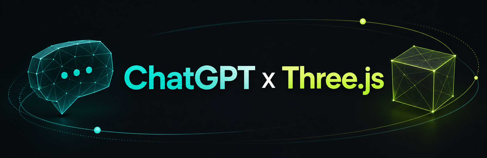

<p align="center">
  
</p>

<h1 align="center">gpthreejs</h1>

<p align="center">
  <strong>Reference images into fidelity-gated procedural Three.js forms.</strong>
</p>

<p align="center">
  <a href="LICENSE"></a>
  <a href="SKILL.md"></a>
  
  
</p>

gpthreejs is a code-first asset pipeline for turning a reference image into an
editable TypeScript `THREE.Group` factory. It uses CPU perception, strict
blueprint validation, multi-view metrics, and critique journals to keep generated
geometry tied to visible evidence.

It is not photogrammetry, and it is not a mesh marketplace download. The primary
deliverable is source code you can inspect, diff, and own.

## Table of Contents

- [What You Get](#what-you-get)
- [Quick Start](#quick-start)
- [Pipeline](#pipeline)
- [Quality Modes](#quality-modes)
- [Sufficiency Gate](#sufficiency-gate)
- [Surface Detail](#surface-detail)
- [Documentation](#documentation)
- [Repository Layout](#repository-layout)
- [Localized Summaries](#localized-summaries)
- [License](#license)

## What You Get

| Artifact | Purpose |
| --- | --- |
| `sense_pack.json` and maps | Matte, depth proxy, edges, and palette evidence. |
| `brief.json` | Subject class, complexity, and Fidelity Pact. |
| `ledger.json` | Evidence-linked micro features that must map to parts or materials. |
| `blueprint.json` | Part hierarchy, materials, handles, and critique journal. |
| `createXxxForm.ts` | Procedural Three.js factory returning a `THREE.Group`. |

## Quick Start

Install the ChatGPT/Codex skill from this repository:

```bash
cp -a . ~/.codex/skills/gpthreejs
```

Or clone it into your skill directory:

```bash
git clone <your-repo-url> ~/.codex/skills/gpthreejs
```

Requirements:

- Python 3.10 or newer.
- Standard library only for the core CLI.
- Optional CPU vision extras for richer local image analysis.

```bash
pip install -r engine/extras/requirements-cpu.txt
```

Invoke the skill with a reference image:

```text
/gpthreejs Rebuild this object as a Three.js form. qualityMode=sharp.
```

## Pipeline

```text
image
  -> Sense Pack
  -> Intake Brief
  -> Feature Ledger
  -> Form Blueprint
  -> strict validation
  -> layer cast
  -> multi-view render
  -> metrics and critique
  -> accept | replan | recode
```

Example CLI flow:

```bash
python3 -m engine probe samples/demo.png
python3 -m engine sense samples/demo.png --out work/sense --mode sharp
python3 -m engine brief "FieldRadio" --image samples/demo.png \
  --sense work/sense/sense_pack.json --out work/brief.json
python3 -m engine ledger samples/demo.png --sense work/sense --out work/ledger.json
python3 -m engine blueprint "FieldRadio" --brief work/brief.json \
  --ledger work/ledger.json --sense work/sense/sense_pack.json --out work/blueprint.json
python3 -m engine validate work/blueprint.json --strict
python3 -m engine cast work/blueprint.json --out src/createFieldRadioForm.ts
python3 -m engine metrics --reference samples/demo.png --render work/view.png \
  --matte work/sense/matte.png --out work/metrics.json
```

## Quality Modes

| Mode | Use when |
| --- | --- |
| `draft` | You need a fast sketch. |
| `solid` | You need an everyday prop with basic evidence checks. |
| `sharp` | You want the default high-quality path with CPU fit and multi-view review. |
| `razor` | You are creating hero assets and can spend a longer search budget. |
| `hybrid` | You explicitly opt into an external GLB body plus gpthreejs materials and handles. |

## Sufficiency Gate

Run sufficiency before production casting. If the reference is too weak, the
agent must ask for remedies or abort instead of generating shallow code.

```bash
python3 -m engine sufficiency samples/knight/knight_01_hero_34.png \
  --sense demo/work/sense --domain character --intent game \
  --view-count 1 --out work/sufficiency.json
```

Key fields:

- `verdict`: `pass`, `conditional`, or `reject`
- `agentAction`: `continue`, `ask`, or `abort`
- `userMessage`: end-user summary returned verbatim

See [playbook/sufficiency.md](playbook/sufficiency.md).

## Surface Detail

Use the generic micro/meso detail stack when primitives are not enough:

```bash
python3 -m engine surface-annotate work/blueprint.json --level high --in-place
python3 -m engine surface-bake --out work/surfaces --level high
```

Runtime helpers live in `demo/src/detail/surfaceKit.ts`:

- `physical(role)`
- `rivetRing`
- `edgeBand`

Supported material roles include metal, brass, cloth, leather, plastic, wood,
and stone. See [playbook/surface_detail.md](playbook/surface_detail.md).

## Documentation

Project documentation is managed by type under [docs/](docs/).

| Area | Document |
| --- | --- |
| Index | [docs/readme.md](docs/readme.md) |
| Upgrade plan | [docs/planning/chatgpt-app-game-animation-upgrade.md](docs/planning/chatgpt-app-game-animation-upgrade.md) |
| Multi-agent prompt | [docs/planning/multiagent-execution-prompt.md](docs/planning/multiagent-execution-prompt.md) |
| ChatGPT App | [docs/app/chatgpt-app.md](docs/app/chatgpt-app.md) |
| Security | [docs/app/security.md](docs/app/security.md) |
| Privacy | [docs/app/privacy.md](docs/app/privacy.md) |
| Runbook | [docs/app/runbook.md](docs/app/runbook.md) |

## Repository Layout

```text
SKILL.md       Agent instructions
engine/        CLI and pure Python pipeline
playbook/      Runtime rubrics and recipes
docs/          Project documentation by type
examples/      Sample blueprint
samples/       Reference images
demo/          Three.js preview project
tests/         Python smoke and regression tests
```

## Design Principles

1. Use engine metrics as floors and agent judgment for identity.
2. Spend CPU on matte, edges, depth proxy, and fit before more code generation.
3. Ship editable source instead of opaque assets.
4. Block shallow plans with strict validation.
5. Use maps for micro detail and kits for meso detail.
6. Admit blind sides; one photo does not prove hidden geometry.

## Localized Summaries

### 한국어

gpthreejs는 참조 이미지를 Sense Pack, Feature Ledger, Form Blueprint, TypeScript
`THREE.Group` 팩토리로 변환하는 절차적 Three.js 제작 도구입니다. 사진측량이나
마켓플레이스 메시 다운로드가 아니라, 검증 가능한 지표와 편집 가능한 소스 코드를
출력하는 것을 목표로 합니다. 프로젝트 문서는 `docs/` 아래에서 유형별로 관리합니다.

### 中文

gpthreejs 将参考图像转换为 Sense Pack、Feature Ledger、Form Blueprint 和
TypeScript `THREE.Group` 工厂。它不是摄影测量，也不是模型市场下载流程；目标是
输出可验证、可编辑的程序化 Three.js 源码。项目文档按类型统一放在 `docs/` 目录中。

### 日本語

gpthreejs は参照画像を Sense Pack、Feature Ledger、Form Blueprint、TypeScript
`THREE.Group` ファクトリへ変換する手続き型 Three.js 制作ツールです。フォトグラメトリ
やメッシュ配布ではなく、検証可能で編集できるソースコードを出力することを目的とします。
プロジェクト文書は種類別に `docs/` 配下で管理します。

## License

MIT. See [LICENSE](LICENSE).
